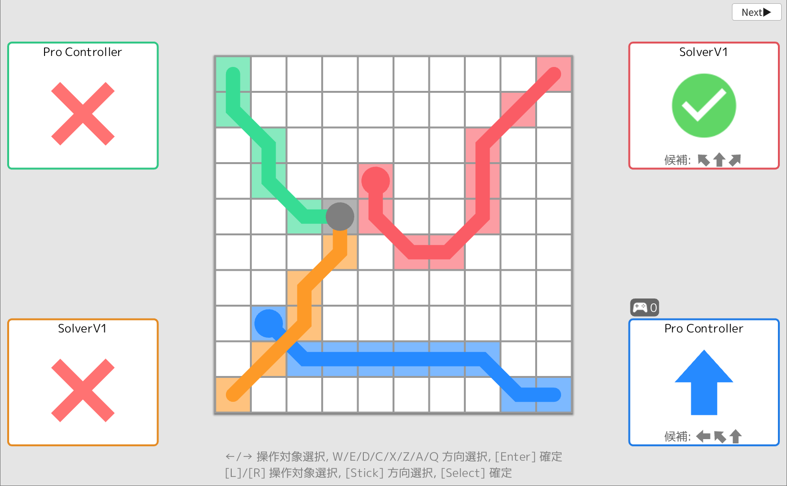
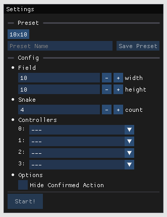
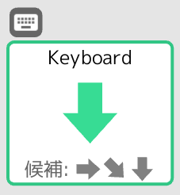

# Super Snake (スーパースネーク)

最大4人対戦のスネークゲームです

ルール：   
- 各プレイヤーは盤面の四隅からスタートします
- ステップごとに、今向いている方向から直進/右斜め前/左斜め前に進むことができます
- ゲームオーバーの条件
  - 盤面外に進む
  - 自分自身や他のプレイヤーの胴体に衝突
  - 同じステップでプレイヤー同士が同じマスに進む
- 最後まで生き残ったプレイヤーが勝ちとなります

## 設定画面

- Preset (プリセット設定)   
  ゲーム設定を保存することができます   
  上部のボタンを左クリック：設定の呼び出し   
  上部のボタンを右クリック：設定の削除   
  `Save Preset`ボタン：設定をプリセットに名前をつけて保存

- Config (ゲーム設定)
  - Field   
    盤面の大きさ
  - Snake   
    ヘビ(プレイヤー)の数
  - Controllers   
    - Solver: コンピューター
    - Gamepad: プロコン/Joy-Conなどのコントローラーで操作 (右のConfigでボタンの割り当てができます)
    - Keyboard: キーボード操作
  - Options
    - Hide Confirmed Action   
      確定したプレイヤーの入力を非表示にします

設定をしたら、`Start!`ボタンでゲームを開始します

## ゲーム画面

- 上部アイコン   
  操作中のコントローラーが表示されます。操作を確定するとアイコンが非表示になります。

- 矢印アイコン   
  次のステップで移動する向きが表示されます。今向いている向きに応じて、次の選択肢が候補に表示されます。

### 操作方法

**キーボード**

`W`/`E`/`D`/`C`/`X`/`Z`/`A`/`Q` キー：移動方向の選択

`←`/`→` キー：(操作対象が複数ある場合) 操作対象の選択

`Enter` キー：操作の確定

**コントローラー**

スティック：移動方向の選択

`L`/`R` ボタン：(操作対象が複数ある場合) 操作対象の選択

`Select` ボタン：操作の確定
